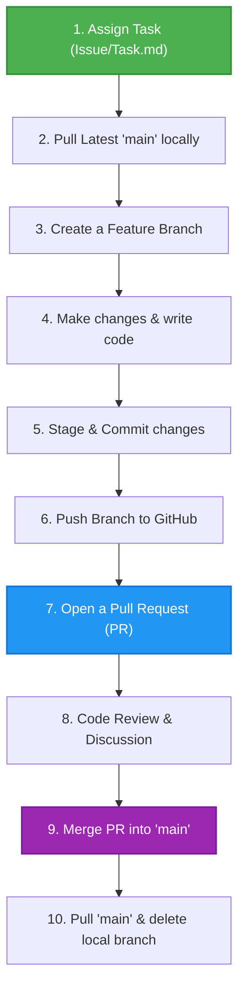

# 🤝 Real-World GitHub Collaboration & Git Guide

Welcome to your shared workspace! This guide is designed to help you and your friend collaborate smoothly on GitHub. By following these steps, you will practice the exact **Feature Branch Workflow** used by professional software engineering teams worldwide.

---

## 🔄 The Collaboration Workflow



---

## 📋 Table of Contents
1. [Assigning Tasks](#1-assigning-tasks)
2. [Step-by-Step Git Commands](#2-step-by-step-git-commands)
   - [Phase A: Setting Up & Starting](#phase-a-setting-up--starting)
   - [Phase B: Making Changes & Saving](#phase-b-making-changes--saving)
   - [Phase C: Publishing & Merging](#phase-c-publishing--merging)
   - [Phase D: Cleaning Up & Syncing](#phase-d-cleaning-up--syncing)
3. [💡 Pro-Tips & Best Practices](#-pro-tips--best-practices)
4. [🛠️ Troubleshooting & Handy Commands](#%EF%B8%8F-troubleshooting--handy-commands)

---

## 1. Assigning Tasks

To collaborate effectively, you should always know **who** is working on **what**.
* **Method A (GitHub Issues):** Go to the GitHub repository online, click on the **Issues** tab, and create an issue (e.g., *"Task: Add employee table"*). Assign it to your friend.
* **Method B (Task.md file):** Update the `Task.md` file in the main branch to assign a task:
  ```markdown
  - [ ] Task: Add a table of employees | Assigned to: @suhana-io
  ```

---

## 2. Step-by-Step Git Commands

Whenever a task is assigned, follow this lifecycle strictly to avoid overwriting each other's code.

### Phase A: Setting Up & Starting

Before writing any code, make sure you are working on the latest version of the project.

#### 1. Go to the `main` branch
Always start from the `main` branch.
```bash
git checkout main
```

#### 2. Pull the latest updates from GitHub
Someone else might have merged new code. Pull it to your local computer.
```bash
git pull origin main
```

#### 3. Create and switch to a new branch
Never work directly on `main`. Create a unique, descriptive branch name for your task.
```bash
# Syntax: git checkout -b <branch-name>
git checkout -b task-employee-table
```
> [!NOTE]
> The `-b` flag tells Git to create a new branch and automatically switch (`checkout`) to it.

---

### Phase B: Making Changes & Saving

Now, make the necessary code changes (e.g., editing `index.html` or creating new files).

#### 4. Check what files you modified
See your current status and which files have changed.
```bash
git status
```

#### 5. Stage your changes
Tell Git which files you want to include in your next save (commit).
```bash
# Add a specific file:
git add index.html

# OR add all modified and new files:
git add .
```

#### 6. Commit your changes
Save your staged changes locally with a clear descriptive message.
```bash
# Keep messages short and meaningful
git commit -m "feat: add employee list table to index.html"
```

---

### Phase C: Publishing & Merging

Get your local branch up to GitHub and request feedback.

#### 7. Push the branch to GitHub
Upload your local branch so your friend can see it.
```bash
# Syntax: git push -u origin <branch-name>
git push -u origin task-employee-table
```
> [!TIP]
> The `-u` flag sets the "upstream" tracking branch, so next time you can just type `git push`.

#### 8. Open a Pull Request (PR) on GitHub
1. Go to your repository page on GitHub.
2. You will see a yellow banner: **"task-employee-table had recent pushes... Compare & pull request"**.
3. Click **Compare & pull request**.
4. Add a description explaining your changes, then click **Create pull request**.
5. Assign your friend as a **Reviewer** so they can review and approve it!

#### 9. Review and Merge the Pull Request
Once approved:
* Click the green **Merge pull request** button on GitHub.
* Click **Confirm merge**.
* The code is now successfully integrated into the `main` branch on GitHub!

---

### Phase D: Cleaning Up & Syncing

Now that the task is complete, clean up your workspace so it doesn't get cluttered.

#### 10. Switch back to `main`
```bash
git checkout main
```

#### 11. Pull the merged changes
Bring the newly merged code from GitHub back down to your computer.
```bash
git pull origin main
```

#### 12. Delete the temporary branch
Since the branch is merged, you can delete it safely.
```bash
# Delete local branch
git branch -d task-employee-table

# Delete remote reference (optional)
git fetch --prune
```

---

## 💡 Pro-Tips & Best Practices

1. **Commit Early and Often:** Don't write 500 lines of code before committing. Make small, logical commits (e.g., "add structure", "add styling", "fix bug").
2. **Never commit directly to `main`:** Keep the `main` branch clean and working at all times.
3. **Communicate in the PR:** Use the comments in the Pull Request to talk about code changes, ask questions, or request adjustments.

---

## 🛠️ Troubleshooting & Handy Commands

| Situation | Action / Command | Description |
| :--- | :--- | :--- |
| **Accidentally modified the wrong file** | `git checkout -- <filename>` | Discard changes in a file (before staging). |
| **Want to undo the last commit but keep code** | `git reset --soft HEAD~1` | Uncommits your last save, keeping files modified. |
| **Want to completely delete last commit & code** | `git reset --hard HEAD~1` | ⚠️ **Warning:** Destroys your last commit and modifications. |
| **Save temporary work without committing** | `git stash` | Saves and hides your dirty working directory. |
| **Bring back stashed work** | `git stash pop` | Restores your stashed changes. |
| **Check commit history** | `git log --oneline` | View list of previous commits. |
| **Check active local branches** | `git branch` | Lists all your local branches. |

---

### 🚀 Happy Practicing!
Feel free to update `Task.md`, checkout a new branch, and start collaborating!
